# Getting started 
To access our website, you must have XAMMP installed with the project files on your computer.
 

# How to install XAMPP:

Step 1: Click the link https://www.apachefriends.org/index.html and download the latest version of **XAMPP**.
 
<!-- Images -->
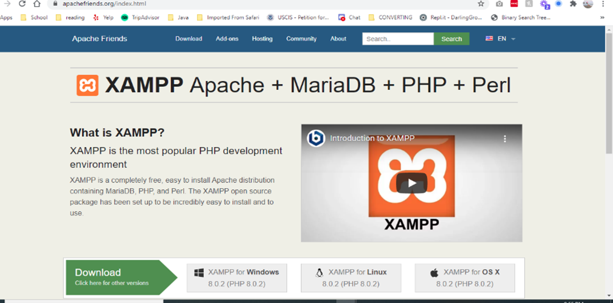
 

Step 2: Select your operating system and download the **XAMPP** installer.
 
 
Step 3: Launch **XAMPP** installer.
 
 
Step 4:
Confirm that you will avoid installing the software to C:\Program Files and press OK. User Account Control
(UAC) might block some **XAMPP** functions when installing to C:\Program Files, so it is recommended to 
install **XAMPP** to the default folder. 
 
 
Step 5: Click Next to start the procedure.
<!-- Imagees -->
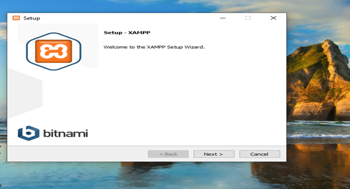
 

Step 6: Select all components and then click Next. 
<!-- Imagees -->
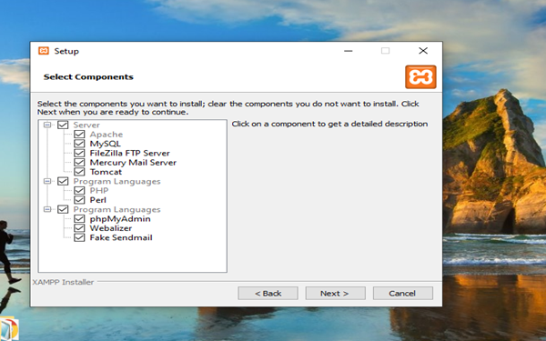
 

Step 7: Select the folder to install **XAMPP** and click Next. It is recommended to install the software into the default folder.
<!-- Imagees -->
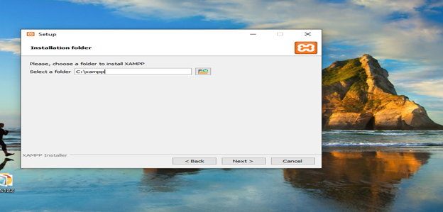
 

Step 8: select your Language
<!-- Imagees -->
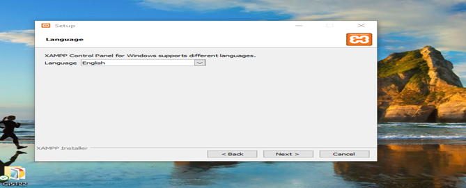
 

Step 9: Untick the Learn more about Bitnami for **XAMPP** checkbox and click Next. 
<!-- Imagees -->
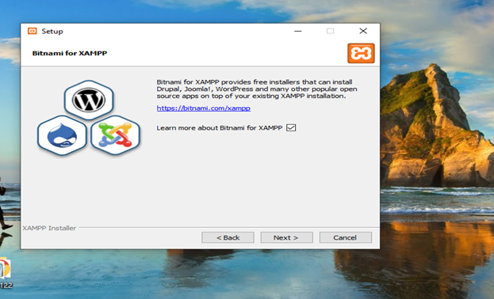
 

Step 10: Click Next to launch installation.
<!-- Imagees -->
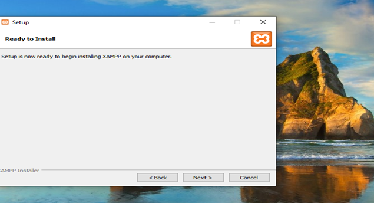
 

Step 11: Once all the components are unpacked and installed, you can close the setup wizard by clicking on ‘Finish’. Click to tick the 
corresponding check box and open the **XAMPP** Control Panel once the installation process is finished.
<!-- Imagees -->
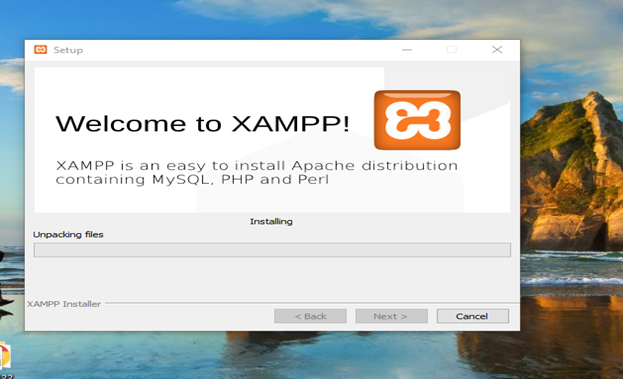
 

Step12: Tick the Apache and MySQL checkboxes in the Autostart of modules section and then click Save.
<!-- Imagees -->
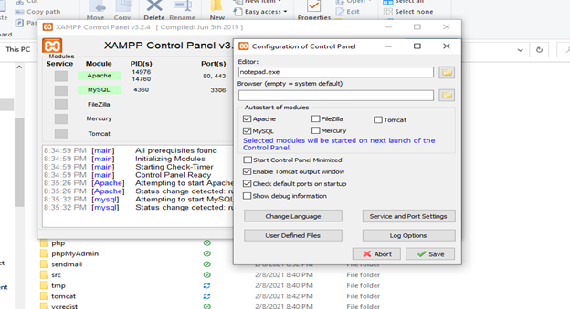
 

Step 13: Green background around Apache and MySQL marks that these modules work correctly.
<!-- Imagees -->
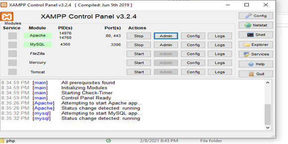

 
**The XAMPP Control Panel**

 
 
Controls for the individual components of your test server can be reached through the XAMPP Control Panel. The clear user interface logs 
all actions and allows you to start or stop individual modules with a single. The XAMPP Control Panel also offers you various other buttons,
including:

 
 
Config: allows you to configure the XAMPP as well as the individual components
Netstat: shows all running processes on the local computer
Shell: opens a UNIX shell
Explorer: opens the XAMPP folder in Windows Explorer
Services: shows all services currently running in the background
Help: offers links to user forums
Quit: closes the XAMPP Control Panel

 
 
 
Step 14: In the browser address line enter localhost. If you see the Welcome to XAMPP for Windows! notification, the environment is set up
and ready for work.
 
 
<!-- Imagees -->
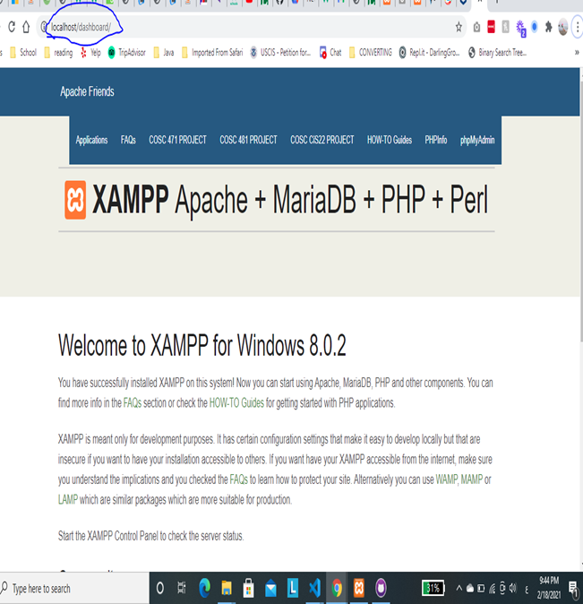

 
 

# How to run the website on your own device

1. open XAMPP 
2. put your project or website files inside htdocs.
<!-- Imagees -->
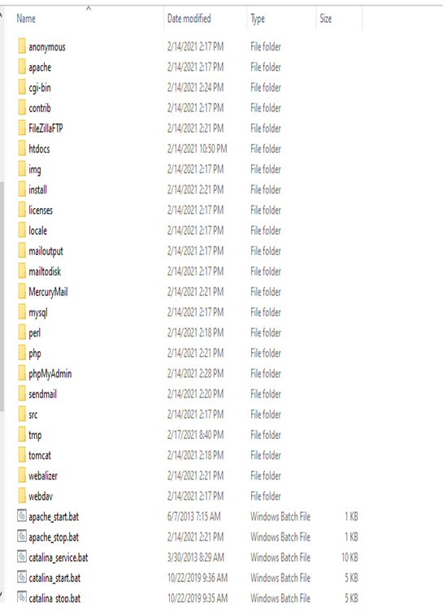

 
 
3. open dashboard and open index.html (this index localhost)
<!-- Imagees -->
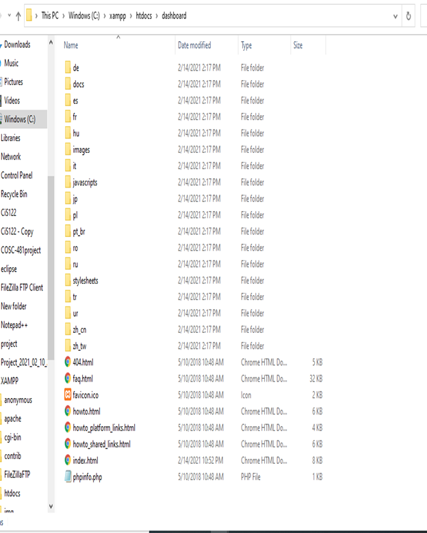

 
 
4. Open index.html with notepad and get to the navigation bar list. Add your project link in this list.   
 (please keep in mind that the project folder name is with the index.html file is the link.)  **
  <li class=””><a href=”/COSC-481project/index.html”>COSC 481 PROJECT </a><li>.
  
<!-- Imagees -->
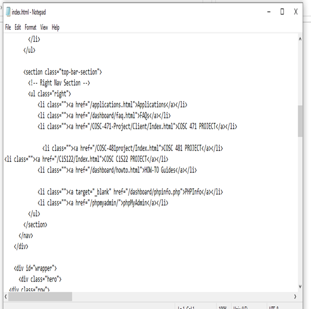
 
 

And save it. 
Open the XAMPP Control Panel and click start for Apache and MySQL.

 
<!-- Imagees -->

 

You have an ‘Admin’ option located on the Control Panel for every module in your XAMPP.
 

**Click the Admin for Apache to access our website.**
 
 
<!-- Imagees -->
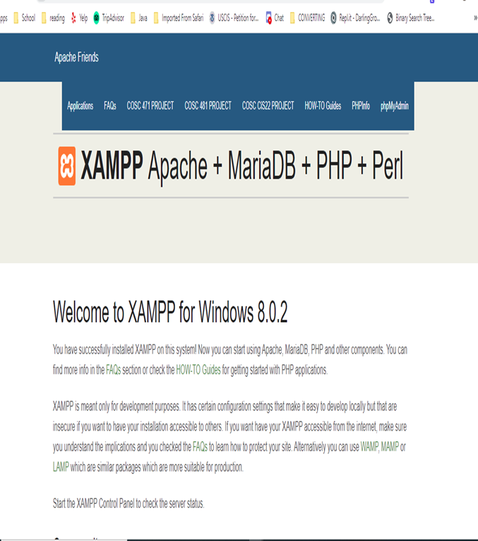
  
  

 To finally access the website, click the project folder name from the page above.
 

 Welcome to Athletisize!
 
 
<!-- Imagees -->
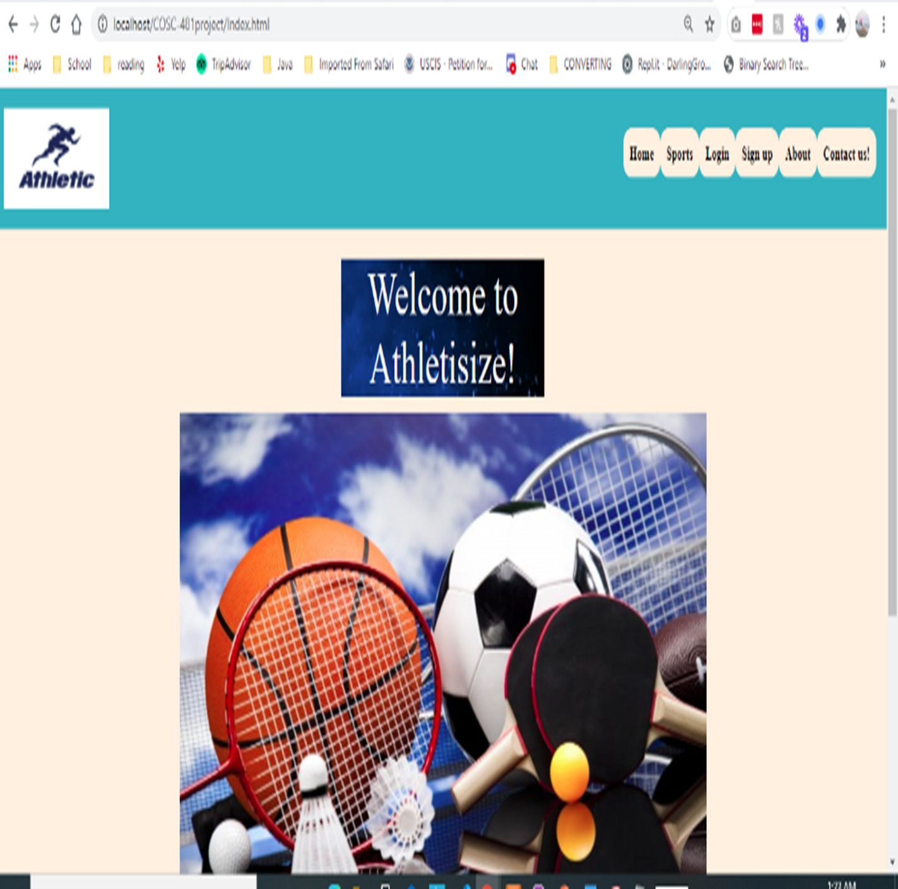
